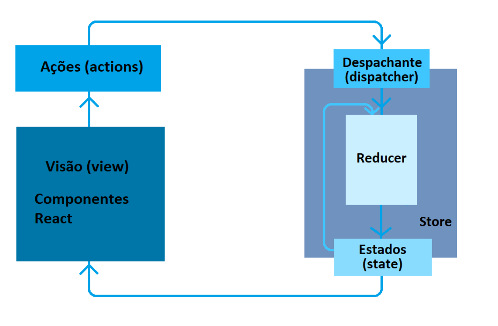

# React-Redux-RTK
React - Redux Tool Kit 

## Para o nosso novo projeto, crie uma pasta e depois não esqueça de colocar seus códigos em um repositório git.

1 - Crie uma pasta;  
2 - Digite: `npm init vite@latest react-redux-rtk --template react-ts` (pode ser outro nome do projeto);  
3 - Instale o node + dependências básicas →  `npm install`;  
4 - E para você que está acostumado com o CRA, usando o Vite a gente executa o projeto usando o comando: `npm run dev`  
5 - Se precisar do React router dom → `npm install -E react-router-dom @types/react-router-dom`. Se desejar colocar uma versão específica é só colocar o @eonumdaversao.  
6 - Para a instalação do Redux ToolKit → `npm install @reduxjs/toolkit`.  

## Algumas das funcionalidades do Redux Toolkit incluem:

- Criação automática de reducers e actions com uma única função `create Slice`;
- Uso de `immer` para tornar a escrita de reducers mais fácil e legível;
- Integração com o `devTools` do Redux para uma melhor depuração e rastreamento de estados;
- Uso opcional de `Redux Thunk` para lidar com chamadas assíncronas

Essas e outras funcionalidades do Redux Toolkit podem ajudar a tornar o desenvolvimento com o Redux mais eficiente e produtivo.

## Importante contextualizar 
O Redux Toolkit vem com alguns pacotes úteis instalados com ele, como `Immer`, `Redux-thunk`, e `Reselect`. Facilita a vida dos desenvolvedores do React, permitindo que eles alterem o estado diretamente (Immer lida com imutabilidade) e adotem middleware como `Thunk` (que lida com ações assíncronas). Ele também usa `Reselect`, uma biblioteca "seletor" simples para Redux, para simplificar funções minificar.

# Como trabalha o RTK?
## createSlice
Uma das características principais do RTK é o createSlice, este recurso que permite definir um conjunto de reducers, actions e selectors para uma fatia (slice) específica do estado da aplicação. 

## createAction
createAction é uma função utilitária do Redux que ajuda a criar ações (actions) de maneira mais fácil e concisa. Normalmente, uma ação (action) é um objeto que possui uma propriedade 'type' que descreve o tipo da ação e uma ou mais propriedades que carregam os dados da ação. Com a createAction, é possível criar uma função que retorna uma ação com o tipo e os dados fornecidos como parâmetros.

## createReducer 
createReducer é uma função utilitária comumente usada em bibliotecas de gerenciamento de estado em JavaScript, como o Redux, para criar um reducer que pode ser usado para atualizar o estado de um aplicativo.

## configureStore
O configureStore é uma função disponibilizada pela biblioteca Redux que permite configurar e criar uma instância da Store, que nada mais é do que um objeto central que mantém o estado global da aplicação em um único local. A Store permite que diferentes componentes da aplicação acessem e atualizem o estado da mesma forma, garantindo assim uma fonte única de verdade.

## Immer
Outra característica é o Immer, o Immer é uma biblioteca JavaScript que ajuda a gerenciar o estado imutável no Redux de uma maneira mais intuitiva e fácil de entender. Ele fornece uma API simples e eficiente para atualizar o estado imutável do Redux, permitindo que você escreva lógica de atualização de estado mais simples e limpa.

## Reselect
Reselect é uma biblioteca de seletores para Redux que ajuda a escrever funções de seleção eficientes que calculam dados derivados do estado da sua aplicação. Em outras palavras, um seletor é uma função que recebe o estado do Redux como argumento e retorna uma parte desse estado que é relevante para um componente específico, evita renderização desnecessária e simplifica a lógica do componente.

## Immutability Helpers
Sabemos que o Redux segue o padrão de fluxo de dados unidirecional. Ele armazena o estado global da aplicação em um único objeto, chamado de Store, que é imutável. Isso significa que não podemos modificar o estado diretamente na Store. Em vez disso, devemos despachar uma ação para o store indicando o que deve ser alterado no estado.

São as reducers, porém dentro das funções chamadas reducers, que são responsáveis por atualizar o estado da store, podemos trabalhar com mutabilidade. Isso porque o Redux usa uma técnica chamada de Immutability Helpers para fazer cópias do estado e modificar apenas a parte necessária dele.

